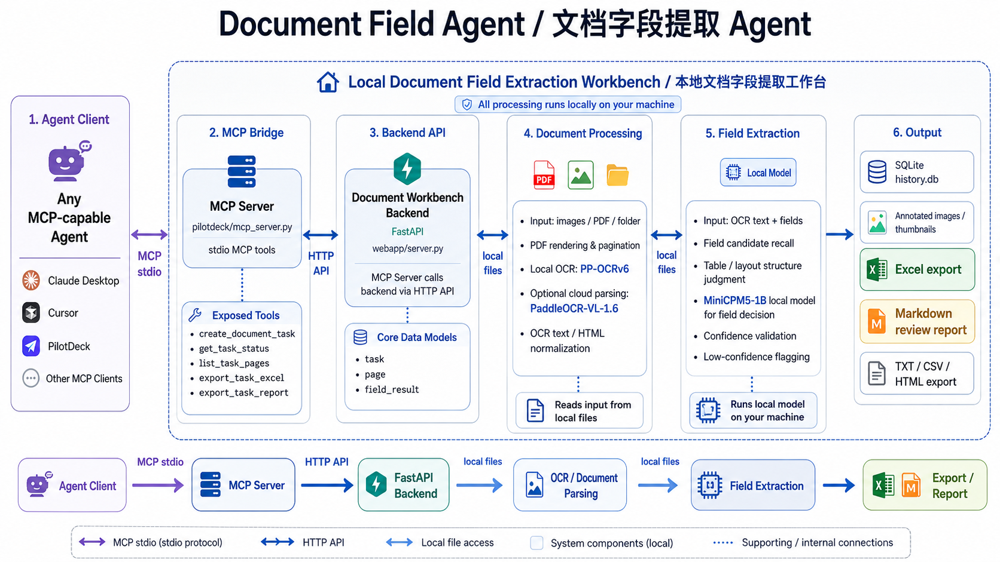
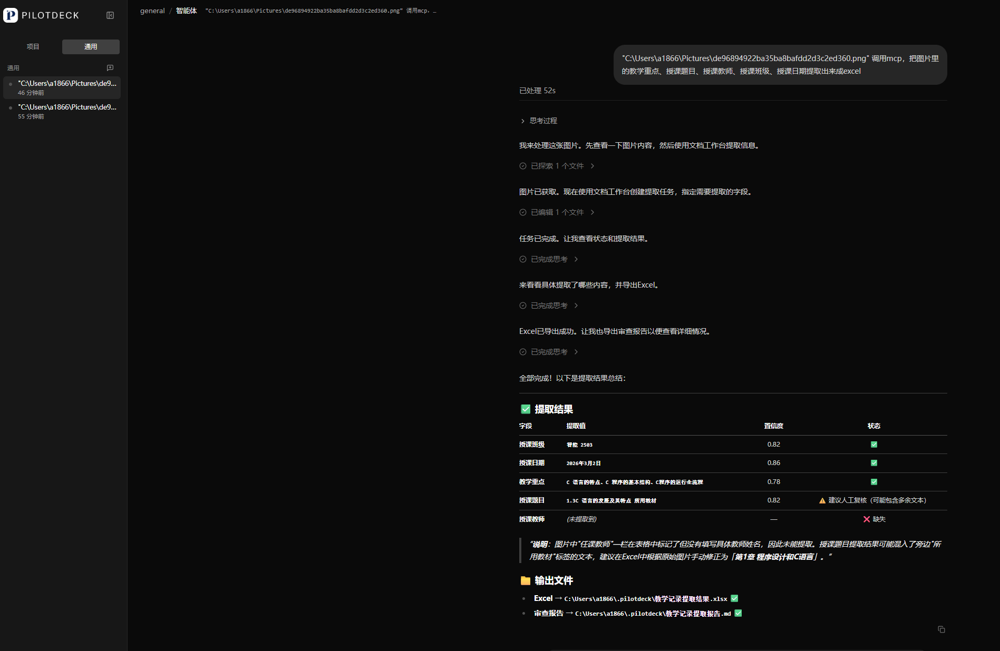

# 文档工作台 / Document Workbench

一个面向日常办公录入场景的批量文档 OCR 与字段抽取工作台。

它可以把 PDF、图片、扫描件中的文字识别出来，再按用户指定字段抽取结构化结果，并导出为 Excel、Markdown、CSV、HTML 或纯文本。典型用途包括教案录入、合同台账、表单归档、档案整理、票据/证明信息提取等重复性文档处理工作。

本项目基于 [andyhuo520/ppocrv6-studio](https://github.com/andyhuo520/ppocrv6-studio) 二次开发。原项目围绕 PP-OCRv6 做了优秀的本地 OCR 工作台、模型切换和评测基础，这个版本在此基础上扩展为“批量文档字段提取工作台”。感谢原作者的开源工作。

## 核心能力

- 批量上传图片、PDF 或文件夹。
- PDF 自动分页：一个 PDF 生成一个任务，多页 PDF 下每页是一条页面记录。
- 任务级历史记录：历史首页按任务展示，进入任务后查看所有页面。
- 字段配置：手动填写字段，或从 Excel 模板第一行读取字段名。
- 字段抽取：从 OCR 全文中抽取指定字段，输出结构化 JSON 结果。
- 低置信度提示：置信度低于阈值的字段会标红，方便复核。
- Excel 导出：有字段时按“每页一行、字段为列”导出。
- 无字段模式：可导出 TXT / Markdown / CSV / HTML。
- 本地优先：本地 OCR + 本地小模型字段抽取，适合隐私文档处理。
- 可选云端高精度：可接 PaddleOCR-VL-1.6 与 DashScope qwen-plus。
- 可选 Agent 调度：内置 PilotDeck Skill / MCP 适配层，可让 Agent 调度批量处理、导出和复核报告。

## 技术路线

```text
文件 / 文件夹 / PDF
  -> PDF 渲染与分页
  -> PP-OCRv6 本地 OCR 或云端 PaddleOCR-VL 解析
  -> OCR 全文 / HTML 文本归一化
  -> 字段候选召回与结构判断
  -> MiniCPM5-1B 本地小模型裁决字段值
  -> 置信度校验
  -> Excel / Markdown / CSV / HTML / TXT 导出
```

本地字段抽取默认使用：

- `openbmb/MiniCPM5-1B-GGUF`
- 默认量化文件：`MiniCPM5-1B-Q4_K_M.gguf`
- 运行方式：`llama.cpp / llama-server` CPU sidecar

本地模型不是直接“硬读图”，而是在 OCR、候选召回、表格/版面结构判断之后做字段裁决。这样可以用更小的模型完成更稳定的字段抽取。

## 项目结构



| 路径 | 说明 |
| --- | --- |
| `webapp/server.py` | FastAPI 后端，包含 OCR 推理、任务/页面/字段存储、PDF 渲染、导出接口 |
| `webapp/static/` | 单页前端 UI |
| `pilotdeck/` | PilotDeck Skill、MCP/CLI 适配层和示例 |
| `scripts/download_models.sh` | 下载 PP-OCRv6 ONNX 模型 |
| `scripts/setup_minicpm5_sidecar.py` | 下载 MiniCPM5-1B GGUF 与 llama.cpp CPU sidecar |
| `assets/` | 示例图片、截图和评测素材 |
| `bench_local_v2.py` | OmniDocBench 本地评测脚本 |

运行时数据会写入 `webapp/data/`，模型文件会写入 `models/`、`ppocrv6_onnx/`、`tools/llama/` 等目录。这些目录默认不会提交到 Git。

## 环境要求

- Python 3.10+
- Windows
- 建议内存 8GB+
- 本地字段抽取需要约 700MB 的 MiniCPM5-1B GGUF 模型文件
- PDF 支持依赖 `pypdfium2`

验证状态：

- Windows：已验证 OCR、任务处理、字段抽取、Excel 导出与 PilotDeck MCP 调用流程。
- macOS / Linux：当前分支尚未完整验证。理论上 FastAPI、ONNX Runtime、llama.cpp 都可跨平台运行，但启动脚本、模型下载、MCP 调用和本地 sidecar 仍需要实机确认。
- OCR 能力来自 PP-OCRv6，本地 OCR 主流程已完成验证。

## 快速开始

### 1. 克隆项目

```bash
git clone https://github.com/BHD110/document-field-agent.git
cd document-field-agent
```

### 2. 创建虚拟环境并安装依赖

Windows PowerShell：

```powershell
python -m venv .venv
.\.venv\Scripts\Activate.ps1
pip install -r requirements-webapp.txt
```

macOS / Linux：

```bash
python -m venv .venv
source .venv/bin/activate
pip install -r requirements-webapp.txt
```

### 3. 下载 PP-OCRv6 模型

```bash
bash scripts/download_models.sh all
```

脚本会下载 Tiny / Small / Medium 三档 ONNX 模型。模型文件不会进入 Git 仓库。

### 4. 准备本地字段抽取模型

```bash
python scripts/setup_minicpm5_sidecar.py
```

脚本会下载：

- `models/minicpm5-1b-q4_k_m.gguf`
- `tools/llama/llama-server` 或 `tools/llama/llama-server.exe`

### 5. 启动 MiniCPM5 sidecar

Windows PowerShell：

```powershell
.\tools\llama\llama-server.exe `
  -m .\models\minicpm5-1b-q4_k_m.gguf `
  --host 127.0.0.1 `
  --port 11435 `
  -c 4096 `
  -t 8 `
  --chat-template chatml
```

macOS / Linux：

```bash
./tools/llama/llama-server \
  -m ./models/minicpm5-1b-q4_k_m.gguf \
  --host 127.0.0.1 \
  --port 11435 \
  -c 4096 \
  -t 8 \
  --chat-template chatml
```

如需改端口，可在启动后端时设置：

```bash
DOC_WORKBENCH_LOCAL_LLM_URL=http://127.0.0.1:11436/v1/chat/completions python webapp/server.py
```

### 6. 启动文档工作台

```bash
python webapp/server.py
```

浏览器打开：

```text
http://127.0.0.1:8766
```

如果需要改端口：

```bash
DOC_WORKBENCH_PORT=8767 python webapp/server.py
```

## 使用方式

1. 在首页上传 PDF、图片或文件夹。
2. 输入要抽取的字段，例如：姓名、单位、课程名称、合同编号、日期、金额等。
3. 也可以上传 Excel 模板，系统会读取第一个 sheet 的第一行作为字段名。
4. 选择本地模式或云端模式。
5. 处理完成后进入结果页查看全文与字段结果。
6. 低置信度字段会标红，方便人工复核。
7. 点击导出，生成 Excel 或其他格式文件。

## 云端模式

云端模式是可选能力，用于更高精度的文档解析与字段抽取。

支持的环境变量：

```bash
DASHSCOPE_API_KEY=...
PADDLEOCR_VL_TOKEN=...
```

也可以通过 `scripts/make_secret_blob.py` 生成本地运行时混淆 blob，但这只是便于部署的混淆方案，不是真正的密钥安全边界。请不要把任何 API Key、token、`.env`、`secrets.blob` 或运行日志提交到仓库。

## MCP / Agent 接入

项目内置了一个轻量的 MCP Server，用来把“文档字段提取工作台”暴露给外部 Agent 调用。它不依赖某个特定 Agent 客户端；只要客户端支持 MCP，就可以接入。


MCP 工具包括：

- `create_document_task`
- `get_task_status`
- `list_task_pages`
- `export_task_excel`
- `export_task_report`

启动文档工作台后，任意 MCP Client 都可以通过这个 MCP Server 调用本地服务，实现“从本地路径创建任务 -> 查询状态 -> 导出 Excel -> 生成复核报告”的自动化流程。



上图是在 PilotDeck 中演示 MCP 调用效果：用户给出本地图片路径和需要抽取的字段，Agent 通过 MCP 创建文档任务、读取处理状态、汇总字段结果，并导出 Excel 与复核报告。MCP Server 本身是通用的，也可以接入任何支持 MCP 的 Agent。

## API 概览

| 接口 | 说明 |
| --- | --- |
| `GET /health` | 健康检查 |
| `GET /info` | 当前模型、配置和工作台信息 |
| `POST /tasks` | 从上传文件创建任务 |
| `GET /tasks` | 获取历史任务 |
| `GET /tasks/{id}` | 获取任务详情 |
| `GET /tasks/{id}/pages` | 获取任务页面 |
| `GET /tasks/{id}/export?fmt=xlsx\|txt\|md\|csv\|html` | 导出任务结果 |
| `POST /templates/fields` | 从 Excel 模板读取字段名 |
| `POST /agent/tasks/from-path` | Agent 专用：从本地路径创建任务 |
| `GET /agent/tasks/{id}/summary` | Agent 专用：任务摘要 |
| `GET /agent/tasks/{id}/report?fmt=md\|json` | Agent 专用：复核报告 |

旧版 `/ocr` 接口仍保留，用于兼容单图 OCR 调用。

## 开发与检查

编译检查：

```bash
python -m compileall webapp bench_local_v2.py gen_result_vis.py run_apple_vision.py scripts/make_secret_blob.py scripts/setup_minicpm5_sidecar.py pilotdeck/mcp_server.py
```

常用 smoke test：

- 上传单张图片，生成 1 个任务、1 条页面记录。
- 上传多页 PDF，确认历史页只显示 1 个任务。
- 使用 Excel 模板读取字段。
- 有字段模式导出 Excel。
- 无字段模式导出 TXT / Markdown / CSV / HTML。
- 低置信度字段在结果页标红。
- MCP Server 能列出工具并创建任务。

## 企业合作 / 定制服务

如果你的团队有大量重复性的资料识别、系统录入、知识库问答、数据抓取、内容生成、客服或运营流程，可以基于本项目或现有 AI 自动化能力做进一步落地。

目前支持通用产品交付，也承接行业定制。可覆盖的方向包括：

- 文档识别、字段抽取、自动录入系统
- 企业知识库、知识库问答、内部资料检索
- AI 客服、运营助手、内容生成工作流
- 小红书等内容平台自动化
- 直播监控、数据抓取与异常提醒
- Wind 数据分析、行业数据处理
- 医疗 AI、律所资料录入等垂直场景

有类似需求的企业或团队，可以扫码添加微信沟通。


## 开源与致谢

本项目基于 [andyhuo520/ppocrv6-studio](https://github.com/andyhuo520/ppocrv6-studio) 二次开发，感谢原作者对 PP-OCRv6 本地工作台、评测流程和真实场景样例的开源贡献。

同时感谢以下开源项目与模型：

- [PaddleOCR](https://github.com/PaddlePaddle/PaddleOCR)
- [ONNX Runtime](https://onnxruntime.ai/)
- [llama.cpp](https://github.com/ggml-org/llama.cpp)
- [OpenBMB MiniCPM](https://github.com/OpenBMB/MiniCPM)
- [FastAPI](https://fastapi.tiangolo.com/)

## License

本项目沿用 MIT License，详见 [LICENSE](LICENSE)。

第三方模型、数据集与云端 API 的使用请遵循其各自许可证和服务条款。
